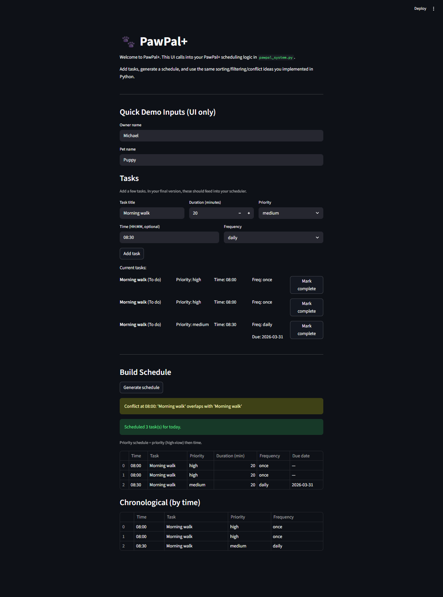

# PawPal+ (Module 2 Project)

You are building **PawPal+**, a Streamlit app that helps a pet owner plan care tasks for their pet.

## Scenario

A busy pet owner needs help staying consistent with pet care. They want an assistant that can:

- Track pet care tasks (walks, feeding, meds, enrichment, grooming, etc.)
- Consider constraints (time available, priority, owner preferences)
- Produce a daily plan and explain why it chose that plan

Your job is to design the system first (UML), then implement the logic in Python, then connect it to the Streamlit UI.

## What you will build

Your final app should:

- Let a user enter basic owner + pet info
- Let a user add/edit tasks (duration + priority at minimum)
- Generate a daily schedule/plan based on constraints and priorities
- Display the plan clearly (and ideally explain the reasoning)
- Include tests for the most important scheduling behaviors

## Getting started

### Setup

```bash
python -m venv .venv
source .venv/bin/activate  # Windows: .venv\Scripts\activate
pip install -r requirements.txt
```

### Suggested workflow

1. Read the scenario carefully and identify requirements and edge cases.
2. Draft a UML diagram (classes, attributes, methods, relationships).
3. Convert UML into Python class stubs (no logic yet).
4. Implement scheduling logic in small increments.
5. Add tests to verify key behaviors.
6. Connect your logic to the Streamlit UI in `app.py`.
7. Refine UML so it matches what you actually built.

## Smarter Scheduling

The scheduler is more than a plain list. It uses a few simple rules to make the daily plan more useful:

- **Priority-first sorting** — high priority tasks always appear before medium or low, regardless of their scheduled time. Time is the tiebreaker within the same priority level.
- **Time-based sorting** — tasks can also be sorted purely chronologically using `sort_by_time()`. Tasks without a scheduled time fall to the end.
- **Filtering** — tasks can be filtered by pet name, completion status, or both, so you can quickly see just what's left for a specific pet.
- **Recurring tasks** — daily and weekly tasks automatically advance their due date when marked complete, so they show up again on the next cycle without being re-added manually.
- **Conflict detection** — if two tasks are scheduled at the exact same time, the scheduler flags it with a warning instead of silently dropping one.

## Testing PawPal+

From the project root, with your virtualenv active:

```bash
python -m pytest
```

I wrote tests for one-off task completion, adding tasks to a pet, time sorting (`sort_by_time`), daily recurrence (`due_date` after `mark_complete`), conflict warnings when two tasks share a time, and an empty schedule when there are no tasks.

**Confidence:** about 4/5 — the core paths above are covered, and the tests hit a few important edge cases too.

## Features

- Add pet care tasks (title, duration, priority, optional time like `HH:MM`, and frequency like `daily`/`weekly`).
- Generate a daily schedule using priority (high → low) and then time.
- Sort tasks by time with `sort_by_time()`.
- Filter tasks by completion status with `filter_tasks()`.
- Detect basic scheduling conflicts when multiple tasks share the exact same time.
- Mark tasks complete, including recurrence (daily/weekly tasks update their next due date automatically).

## 📸 Demo

<a href="demo.png" target="_blank"></a>
