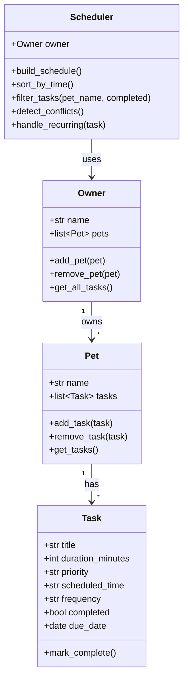

# PawPal+ UML Draft

```mermaid
classDiagram
    class Owner {
        +str name
        +list~Pet~ pets
        +add_pet(pet)
        +remove_pet(pet)
        +get_all_tasks()
    }

    class Pet {
        +str name
        +list~Task~ tasks
        +add_task(task)
        +remove_task(task)
        +get_tasks()
    }

    class Task {
        +str title
        +int duration_minutes
        +str priority
        +str scheduled_time
        +str frequency
        +bool completed
        +date due_date
        +mark_complete()
    }

    class Scheduler {
        +Owner owner
        +build_schedule()
        +sort_by_time()
        +filter_tasks(pet_name, completed)
        +detect_conflicts()
        +handle_recurring(task)
    }

    Owner "1" --> "*" Pet : owns
    Pet "1" --> "*" Task : has
    Scheduler --> Owner : uses
```
